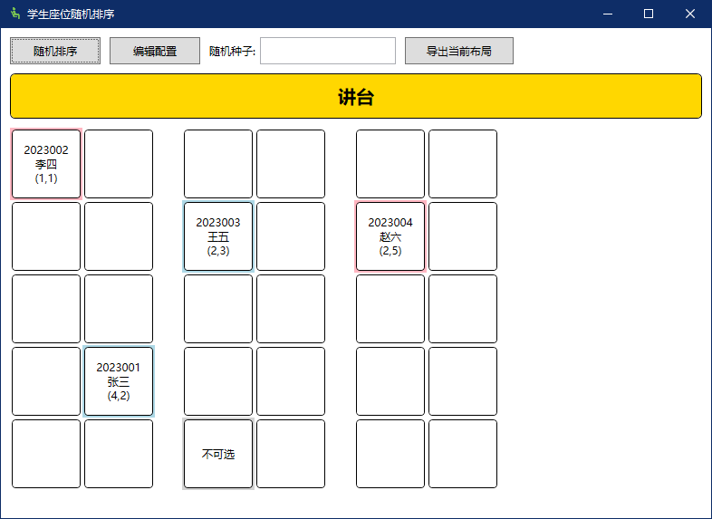

# Seat Randomizer

[简体中文](README_zh-CN.md) | English


A cross-platform desktop application for random seat arrangement, especially suitable for classroom environments. Supports custom classroom layout, personnel list import, and seat layout export functionality.



## ✨ Features

- Developed with .NET and Avalonia UI for perfect cross-platform compatibility and smoother performance!
- Supports custom empty rows and columns in seat layout.
- Male students displayed in light blue, female students in pink.
- Supports same-gender seat pairing functionality.
- Podium displayed below the seating area.
- Supports exporting current seat layout to spreadsheet files.
- Automatically generates configuration files and student list templates on first run.
- Excellent i18n support, automatically switches based on system language.

## 🛠 Usage Instructions

### First Run
When running the program for the first time, it will automatically create the following files:
- `config.yaml` - Seat layout configuration file
- `people.csv` - Student list template file

The program interface includes:
- Toolbar: Random sorting, configuration editing, random seed input, layout export
- Podium area: Displays "Podium" text
- Seating area: Displays student seats in the format "ID Name (Row,Column)"

### Configuring Classroom Layout
1. Click the "Edit Configuration" button to open the `config.yaml` file
2. Modify the configuration and save the file
3. Click the "Random Sort" button again to apply the new configuration

### Adding Student Information
1. Edit the `people.csv` file
2. Add student information according to the format
3. Click the "Random Sort" button again to apply the new student list

## ⚙️ Configuration File Details

The program uses a YAML format configuration file `config.yaml`, located in the program's running directory. Below is a detailed configuration explanation:

### Basic Configuration
```yaml
layout:
  rows: 3      # Number of rows in the classroom
  columns: 4   # Number of columns in the classroom
```

- `rows`: Defines the number of rows in the classroom, counted from the podium downward
- `columns`: Defines the number of columns in the classroom, counted from left to right

Note: The program automatically adds an aisle (empty column) after every two seat columns, so the actual displayed number of columns will be greater.

### Excluded Seats Configuration
```yaml
disabled_seats:
  - [0, 0]        # Specifies which position is unavailable
```

- `disabled_seats`: A list specifying which seats cannot be used.
- Example: `[0, 0]` indicates the seat in the first row (from top) and first column (from left) is unavailable.
- Typically used to avoid windows, doors, or other obstacles.

### Aisle Configuration
```yaml
aisles:
  columns:
    - [1, 2]
  rows:
    - [1, 2]
```

- `columns`: Indicates between which columns an aisle exists, e.g., `[1, 2]` means an aisle exists between the 2nd and 3rd columns (from left)
- `rows`: Indicates between which rows an aisle exists, e.g., `[1, 2]` means an aisle exists between the 2nd and 3rd rows (from top)

### Complete Configuration Example
```yaml
layout:
  rows: 3
  columns: 4
disabled_seats:
  - [0, 0]
aisles:
  columns:
    - [1, 2]
  rows:
    - [1, 2]
```

## 📄 Student List Format

The student list uses CSV format, named `student.csv` (if not specified otherwise in the configuration), with the following format:

```
Number,Name,Sex
1,Zhang San,Male
2,Li Si,Female
3,Wang Wu,Male
4,Zhao Liu,Female
```

- Must contain three columns: Number, Name, Sex (ID, Name, Gender)
- When gender is "male" or "female", the seat border will be colored accordingly, but this does not affect the "same-gender seat pairing" functionality.

- The program automatically generates a CSV file containing 8 example students on first run.

## 📤 Exporting Seat Layout
1. After completing the random seat arrangement
2. Click the "Export Current Layout" button
3. Select the save location and file name
4. Click "Save" to complete the export

The exported XLSX spreadsheet contains the podium and all seats, which can be used for editing, printing, or sharing.

## 🌐 Technical Details
- Development Environment: Visual Studio 2022
- Development Language: C# .NET 8.0
- UI Framework: Avalonia UI
- Dependencies:
  - YamlDotNet 16.3.0 (for YAML configuration file processing)
  - CsvHelper 33.1.0 (for CSV student list processing)
  - ClosedXML 0.105.0 (for XLSX table export)
  - Avalonia 11.3.0 (UI implementation)
  - MessageBox.Avalonia 3.2.0 (interface prompts)

## 📄 License

This project is licensed under the [MIT License](LICENSE), allowing you to freely use, modify, and distribute this software.

```
MIT License

Copyright (c) 2025 Cantonesefish

Permission is hereby granted, free of charge, to any person obtaining a copy
of this software and associated documentation files (the "Software"), to deal
in the Software without restriction, including without limitation the rights
to use, copy, modify, merge, publish, distribute, sublicense, and/or sell
copies of the Software, and to permit persons to whom the Software is
furnished to do so, subject to the following conditions:

The above copyright notice and this permission notice shall be included in all
copies or substantial portions of the Software.

THE SOFTWARE IS PROVIDED "AS IS", WITHOUT WARRANTY OF ANY KIND, EXPRESS OR
IMPLIED, INCLUDING BUT NOT LIMITED TO THE WARRANTIES OF MERCHANTABILITY,
FITNESS FOR A PARTICULAR PURPOSE AND NONINFRINGEMENT. IN NO EVENT SHALL THE
AUTHORS OR COPYRIGHT HOLDERS BE LIABLE FOR ANY CLAIM, DAMAGES OR OTHER
LIABILITY, WHETHER IN AN ACTION OF CONTRACT, TORT OR OTHERWISE, ARISING FROM,
OUT OF OR IN CONNECTION WITH THE SOFTWARE OR THE USE OR OTHER DEALINGS IN THE
SOFTWARE.
```

## 🤝 Contributions

Contributions, issues, and feature requests are welcome! If you find a bug or have suggestions for improvement, please submit them on the Issues page.

---

© 2025 Seat Randomizer | A practical seat management tool
