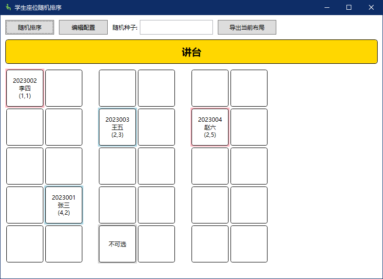

# 🪑 Student Seat Randomizer

[中文](README_zh-CN.md) | English

A Windows application for randomly arranging student seats, specially designed for classroom environments. Supports custom classroom layouts, student list import, and seat layout export.



## ✨ Features

- Randomly assign student seats with fixed seed for reproducible results
- Supports seat layout with an aisle column after every two seat columns
- Coordinate system with (1,1) at the top-left corner (row numbers increase from top to bottom, column numbers increase from left to right)
- Male students displayed in light blue, female students in pink
- Lectern displayed above the seat area
- Supports exporting current seat layout as images
- Automatically generates configuration file and student list template on first run

## 🛠 Usage Instructions

### First Run

1. On first run, the program automatically creates:
   - `config.yaml` - Seat layout configuration file
   - `student.csv` - Student list template file

2. The program interface includes:
   - Toolbar: Randomize, Edit Config, Seed Input, Export Layout
   - Lectern area: Displays "Lectern" text
   - Seat area: Displays student seats in format "ID Name (Row,Column)"

### Configuring Classroom Layout

1. Click "Edit Config" button to open `config.yaml` file
2. Modify configuration and save the file
3. Click "Randomize" button again to apply new configuration

### Adding Student Information

1. Edit the `student.csv` file
2. Add student information following the format
3. Click "Randomize" button again to apply the new student list

## ⚙️ Configuration File Details

The program uses a YAML format configuration file `config.yaml` located in the program's runtime directory. Below is a detailed configuration explanation:

### Basic Configuration

```yaml
rows: 5       # Number of rows in the classroom (from lectern to last row)
columns: 6    # Number of columns in the classroom (excluding aisles)
```

- `rows`: Defines the number of rows in the classroom, counting downward from the lectern
- `columns`: Defines the number of columns in the classroom, counting from left to right

> **Note**: The program automatically adds an aisle (empty column) after every two seat columns, so the actual displayed number of columns will be higher.

### Excluded Columns Configuration

```yaml
excluded_columns: [3, 5]  # Specifies which columns' last row is unavailable
```

- `excluded_columns`: List format, specifies which columns' last row seats are unavailable
- Example: `[3, 5]` means the last row seats in column 3 and column 5 are unavailable
- Typically used to avoid windows, doors, or other obstacles

### Student List Configuration

```yaml
student_csv_path: ""  # Path to the student list CSV file
```

- `student_csv_path`: Specifies the path to the student list file
  - Empty (default): Program will look for `student.csv` in the runtime directory
  - Relative path: e.g., `data/students.csv`, relative to program runtime directory
  - Absolute path: e.g., `C:/school/students.csv`

> **Tip**: On first run, if `student_csv_path` is empty and `student.csv` doesn't exist, the program will automatically create a sample file.

### Complete Configuration Example

```yaml
rows: 5
columns: 8
excluded_columns: [3, 5]
student_csv_path: ""
```

## 📄 Student List Format

The student list uses CSV format, named `student.csv` (if no other path is specified in the configuration), with the following format:

```csv
ID,Name,Gender
2023001,Zhang San,Male
2023002,Li Si,Female
2023003,Wang Wu,Male
2023004,Zhao Liu,Female
```

- Must contain three columns: ID, Name, Gender
- Gender must be "Male" or "Female"
- The program automatically generates a CSV file with 4 sample students on first run

## 📤 Exporting Seat Layout

1. After completing the seat randomization
2. Click the "Export Current Layout" button
3. Select save location and filename
4. Choose image format (PNG, JPG, or BMP)
5. Click "Save" to complete the export

The exported image contains the lectern and all seats, suitable for printing or sharing.

## 🌐 Technical Details

- Development Environment: Visual Studio 2022
- Programming Language: C# .NET 6.0
- UI Framework: WPF
- Dependencies:
  - YamlDotNet (for YAML configuration file processing)
  - CsvHelper (for CSV student list processing)

## 📄 License

This project is licensed under the [MIT License](LICENSE), allowing you to freely use, modify, and distribute this software.

```
MIT License

Copyright (c) 2025 Cantonesefish

Permission is hereby granted, free of charge, to any person obtaining a copy
of this software and associated documentation files (the "Software"), to deal
in the Software without restriction, including without limitation the rights
to use, copy, modify, merge, publish, distribute, sublicense, and/or sell
copies of the Software, and to permit persons to whom the Software is
furnished to do so, subject to the following conditions:

The above copyright notice and this permission notice shall be included in all
copies or substantial portions of the Software.

THE SOFTWARE IS PROVIDED "AS IS", WITHOUT WARRANTY OF ANY KIND, EXPRESS OR
IMPLIED, INCLUDING BUT NOT LIMITED TO THE WARRANTIES OF MERCHANTABILITY,
FITNESS FOR A PARTICULAR PURPOSE AND NONINFRINGEMENT. IN NO EVENT SHALL THE
AUTHORS OR COPYRIGHT HOLDERS BE LIABLE FOR ANY CLAIM, DAMAGES OR OTHER
LIABILITY, WHETHER IN AN ACTION OF CONTRACT, TORT OR OTHERWISE, ARISING FROM,
OUT OF OR IN CONNECTION WITH THE SOFTWARE OR THE USE OR OTHER DEALINGS IN THE
SOFTWARE.
```

## 🤝 Contributing

Contributions, issues, and feature requests are welcome! If you find a bug or have suggestions for improvement, please submit them on the Issues page.

---

© 2025 SeatRandomizer | A practical tool for randomly sorting seats