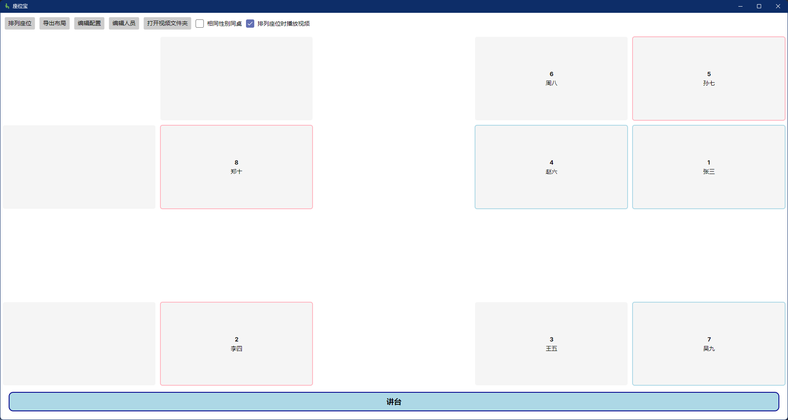

# 🪑 座位宝

简体中文 | [English](README.md)


一个用于随机安排座位的跨平台桌面应用程序，特别适合教室环境使用。支持自定义教室布局、人员名单导入和座位导出功能。



## ✨ 功能特点

- 使用.NET搭配Avalonia UI开发，完美跨平台，运行更流畅！
- 支持自定义空出行和列的座位布局。
- 男生显示为淡蓝色，女生显示为粉红色。
- 支持相同性别同桌功能。
- 讲台显示在座位区域下方。
- 支持导出当前座位布局为表格文件。
- 首次运行自动生成配置文件和学生名单模板。
- 良好的i18n支持，可根据系统语言自动切换。

## 🛠 使用说明

### 首次运行

1. 首次运行程序会自动创建以下文件：
   - `config.yaml` - 座位布局配置文件
   - `people.csv` - 学生名单模板文件

2. 程序界面包含：
   - 工具栏：随机排序、编辑配置、随机种子输入、导出布局
   - 讲台区域：显示"讲台"文字
   - 座位区域：显示学生座位，格式为"学号 姓名 (行,列)"

### 配置教室布局

1. 点击"编辑配置"按钮打开 `config.yaml` 文件
2. 修改配置后保存文件
3. 重新点击"随机排序"按钮应用新配置

### 添加学生信息

1. 编辑 `people.csv` 文件
2. 按照格式添加学生信息
3. 重新点击"随机排序"按钮应用新学生名单

## ⚙️ 配置文件详解

程序使用YAML格式的配置文件 `config.yaml`，位于程序运行目录下。以下是详细配置说明：

### 基本配置

```yaml
layout:
  rows: 3      # 教室的行数
  columns: 4   # 教室的列数
```

- `rows`: 定义教室的行数，从讲台开始往下数
- `columns`: 定义教室的列数，从左到右计数

> **注意**：程序会自动在每两列座位后添加一个过道（空列），所以实际显示的列数会更多。

### 排除列配置

```yaml
disabled_seats:
  - [0, 0]        # 指定哪一个位置不可选
```

- `excluded_columns`: 列表形式，指定哪些列的最后一排座位不可用。
- 示例：`[0, 0]` 表示从左往右第1列从上往下第1行的最后一排座位不可用。
- 通常用于避开窗户、门或其他障碍物。

### 过道列配置

```yaml
aisles:
  columns:
    - [1, 2]
  rows:
    - [1, 2]
```

- `columns`: 表示哪两列之间存在过道，如`[1, 2]`表示从左往右第2列和第3列之间存在过道。
- `rows`: 表示哪两列之间存在过道，如`[1, 2]`表示从上往下第2行和第3行之间存在过道。

### 完整配置示例

```yaml
layout:
  rows: 3
  columns: 4
disabled_seats:
  - [0, 0]
aisles:
  columns:
    - [1, 2]
  rows:
    - [1, 2]
```

## 📄 学生名单格式

学生名单使用CSV格式，文件名为 `student.csv`（如果未在配置中指定其他路径），格式如下：

```csv
Number,Name,Sex
1,张三,Male
2,李四,Female
3,王五,Male
4,赵六,Female
```

- 必须包含三列：Number,Name,Sex（即编号、姓名、性别）
- 性别为"male"或"female"时，座位边框才会正常着色，但是不影响“相同性别同桌”功能
- 程序首次运行时会自动生成包含8个示例学生的CSV文件

## 📤 导出座位布局

1. 完成座位随机排序后
2. 点击"导出当前布局"按钮
3. 选择保存位置和文件名
5. 点击"保存"完成导出

导出的XLSX表格包含讲台和所有座位，可用于编辑、打印或分享。

## 🌐 技术细节

- 开发环境：Visual Studio 2022
- 开发语言：C# .NET 8.0
- UI框架：Avalonia UI
- 依赖库：
  - YamlDotNet 16.3.0 (用于YAML配置文件处理)
  - CsvHelper 33.1.0 (用于CSV学生名单处理)
  - ClosedXML 0.105.0 (用于XLSX表格导出布局)
  - Avalonia 11.3.0 (UI 实现)
  - MessageBox.Avalonia 3.2.0 (界面提示)

## 📄 许可证

本项目采用 [MIT许可证](LICENSE)，您可以自由使用、修改和分发本软件。

```
MIT License

Copyright (c) 2025 Cantonesefish

Permission is hereby granted, free of charge, to any person obtaining a copy
of this software and associated documentation files (the "Software"), to deal
in the Software without restriction, including without limitation the rights
to use, copy, modify, merge, publish, distribute, sublicense, and/or sell
copies of the Software, and to permit persons to whom the Software is
furnished to do so, subject to the following conditions:

The above copyright notice and this permission notice shall be included in all
copies or substantial portions of the Software.

THE SOFTWARE IS PROVIDED "AS IS", WITHOUT WARRANTY OF ANY KIND, EXPRESS OR
IMPLIED, INCLUDING BUT NOT LIMITED TO THE WARRANTIES OF MERCHANTABILITY,
FITNESS FOR A PARTICULAR PURPOSE AND NONINFRINGEMENT. IN NO EVENT SHALL THE
AUTHORS OR COPYRIGHT HOLDERS BE LIABLE FOR ANY CLAIM, DAMAGES OR OTHER
LIABILITY, WHETHER IN AN ACTION OF CONTRACT, TORT OR OTHERWISE, ARISING FROM,
OUT OF OR IN CONNECTION WITH THE SOFTWARE OR THE USE OR OTHER DEALINGS IN THE
SOFTWARE.
```

## 🤝 贡献

欢迎提交问题和拉取请求！如果您发现bug或有改进建议，请在Issues页面提交。

---

© 2025 座位宝 | 一个实用的座位管理工具
